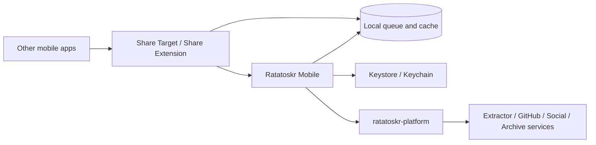
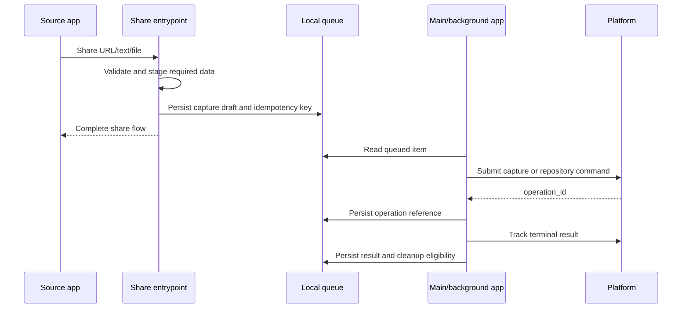

# Ratatoskr Mobile Architecture

> Status: target architecture. This repository is in architecture bootstrap; the document defines the intended Android, iOS, KMP, Share Extension, persistence, and security boundaries.

## 1. Purpose

`ratatoskr-mobile` provides native Android and iOS capture and library experiences for Ratatoskr.

It is responsible for:

- Android Share Target and iOS Share Extension intake;
- explicit article, social-post, file, text, and GitHub repository capture;
- durable offline capture queue;
- local notes, collection/tag intent, and provider-specific options;
- registered-device authentication;
- operation progress and result presentation;
- library, search, and detail views through Platform APIs;
- notifications, deep links, and background retry;
- platform-native accessibility, lifecycle, and secure storage.

It does not store provider credentials, scrape pages, execute Git backup, run LLM inference, or own authoritative archive state.

## 2. Architectural position



Mobile communicates only with Platform public APIs. Domain services are never addressed directly by the client.

## 3. Repository structure

```text
ratatoskr-mobile/
├── shared/
│   ├── domain/
│   ├── capture/
│   ├── queue/
│   ├── api/
│   ├── auth/
│   ├── persistence/
│   ├── capabilities/
│   └── test-support/
├── androidApp/
│   ├── app/
│   ├── share-target/
│   ├── notifications/
│   ├── background/
│   └── platform/
├── iosApp/
│   ├── App/
│   ├── ShareExtension/
│   ├── Notifications/
│   ├── Background/
│   └── Platform/
├── tests/
├── docs/
└── build configuration
```

The exact Gradle/Xcode layout may evolve. Shared business rules remain separate from native UI and operating-system integration.

## 4. Native and KMP boundaries

### 4.1. Shared KMP responsibilities

Appropriate shared modules include:

- capture draft and queue domain models;
- source/platform classification;
- payload validation and limits;
- idempotency and retry policy;
- Platform API contracts/client core;
- operation-state mapping;
- capability handling;
- local database schema and repositories where practical;
- deterministic date/time and freshness rules;
- test fixtures.

### 4.2. Native responsibilities

Remain native:

- SwiftUI and Jetpack Compose UI;
- Android `ACTION_SEND`/`ACTION_SEND_MULTIPLE` handling;
- iOS Share Extension lifecycle;
- Keychain and Android Keystore integration;
- background task schedulers;
- notifications;
- file-provider/content-resolver access;
- platform navigation and deep links;
- accessibility and adaptive layouts;
- OS-specific media/file staging.

Shared code must not hide platform lifecycle or security differences behind an overly broad abstraction.

## 5. Application layers

```text
Presentation
  native screens, navigation, share UI, notifications

Application
  capture orchestration, queue commands, operation tracking

Domain
  capture types, state machines, validation, retry policy

Data
  Platform API, local database, staged files, secure credentials

Platform adapters
  share intents/extensions, background tasks, Keychain/Keystore, connectivity
```

UI observes durable state. Long-running capture work is never held only in a ViewModel or extension process.

## 6. Capture types

### 6.1. Article or page URL

```text
URL
optional title from share source
optional selected text
optional note
local collection/tag intents
capture timestamp
```

Platform routes the URL to Extractor or the appropriate provider service.

### 6.2. Social publication

For X, Instagram, or Threads:

- preserve canonical/original URL;
- set acquisition source to Android Share Target or iOS Share Extension;
- capture explicit timestamp and optional note;
- do not claim native Saved authority;
- do not read provider app credentials or private session data.

### 6.3. GitHub repository

The capture form offers:

```text
metadata
track
star
```

`star` requires a clear confirmation of the external provider mutation. Mobile never receives the GitHub token.

### 6.4. File/document

Supported files are copied into app-controlled staging before the source permission expires.

Captured metadata:

```text
original display name
declared and detected MIME
byte size
content hash when available
staged local reference
source app metadata when safe
```

Provider/file parsing happens server-side.

### 6.5. Plain text or note

Text is size-limited, stored as explicit user content, and can include source-app/URL provenance when provided. It is not treated as an extracted article.

## 7. Share intake architecture

### 7.1. Android Share Target

The Android entrypoint handles:

- `ACTION_SEND` and selected `ACTION_SEND_MULTIPLE` types;
- `text/plain` URLs/text;
- content URIs with temporary permission;
- safe MIME and size checks;
- immediate staging to app-controlled storage when needed;
- creation of a durable queue draft;
- launch of a compact confirmation UI or background enqueue according to user setting.

Content URIs are hostile and may become inaccessible after the share flow. The app does not retain external URI permissions indefinitely without need.

### 7.2. iOS Share Extension

The extension:

- reads `NSExtensionItem` providers under strict time/memory limits;
- accepts supported URL, text, and file types;
- copies required bytes into an App Group staging area;
- writes a minimal durable draft accessible to the main app;
- offers note/collection/provider mode selection;
- completes promptly without waiting for network or server processing.

The main app/background component submits queued work later.

### 7.3. Common principle

```text
share extension lifetime != capture operation lifetime
```

The share entrypoint succeeds when the draft and required bytes are durable locally, not when server extraction/analysis finishes.

## 8. Capture flow



## 9. Local queue architecture

Suggested entities:

```text
capture_drafts
queue_items
staged_files
submission_attempts
operation_refs
operation_results
capability_snapshot
device_state
sync_cursors
local_cache
```

### 9.1. Queue item state

```text
draft
-> queued
-> preparing
-> submitting
-> accepted
-> tracking
-> completed
```

Alternative states:

```text
retry_wait
paused
auth_required
needs_user_input
failed_permanent
cancelled
```

Every transition is durable and transactionally linked to staged-file ownership.

### 9.2. Idempotency

Each intentional capture receives a UUID idempotency key. Retries reuse the same key and request fingerprint. Editing semantic fields after submission creates a new operation rather than mutating the accepted request invisibly.

### 9.3. Concurrency

Queue submission uses bounded concurrency. File uploads may be serialized or limited independently from URL captures. Per-item state prevents duplicate simultaneous workers.

## 10. Staged-file lifecycle

```text
external file/URI
-> validate metadata and policy
-> copy to app-controlled temporary/staging location
-> record size and optional streaming hash
-> upload with resumable/retry-safe protocol
-> wait for server byte verification
-> retain until terminal operation and retention window
-> delete through explicit cleanup state
```

Rules:

- internal filenames derive from IDs/hashes, not display names;
- symlinks and unsupported file types are rejected;
- free space is checked;
- cleanup never removes a file still referenced by a queue item;
- user cancellation and permanent failure have explicit retention behavior;
- local sensitive files use platform data-protection options.

## 11. Device authentication

### 11.1. Pairing

The app pairs with Platform through a browser/session approval or authenticated in-app flow.

```text
request pairing challenge
-> user approves device
-> exchange one-time token
-> store device secret in Keystore/Keychain
-> obtain short-lived access tokens
```

### 11.2. Credential rules

- secrets remain in Android Keystore/iOS Keychain;
- no provider credentials are stored;
- tokens are bound to server origin and device ID;
- rotation and revocation are supported;
- logout/revoke clears local secrets and pauses queue;
- debug logs, backups, screenshots, and analytics exclude tokens;
- server-origin change requires explicit confirmation and re-pairing.

## 12. Platform API architecture

Representative public calls:

```text
POST /v2/devices/pair
GET  /v2/capabilities
POST /v2/captures
POST /v2/github/repositories
POST /v2/ai-archives/imports, when mobile upload is supported
GET  /v2/operations/{id}
GET  /v2/operations/{id}/events
GET  /v2/library
GET  /v2/search
```

The client uses generated/strongly typed models from `ratatoskr-contracts` and handles compatible unknown fields/statuses.

## 13. Capabilities

A cached capabilities snapshot drives feature visibility:

```text
content.submit
github.catalog
github.star_write
vault.snapshots
social.x
social.instagram_capture
social.threads_capture
archive.chatgpt
archive.claude
search
```

Missing or stale capability state results in conservative UI. The client does not infer a backend service from an endpoint error alone.

## 14. External-write confirmation

GitHub star or future provider writes require:

- explicit mode selection;
- provider account indication;
- clear description of external and local effects;
- confirmation near submission;
- operation result separated by sub-action.

A remembered default may choose `metadata` or `track`, but must not silently choose an external write.

## 15. Operation tracking

The app stores operation references and terminal results.

Active tracking:

- SSE while foregrounded when supported;
- polling fallback;
- background refresh through OS scheduler;
- push/local notification on completion when configured.

The local queue does not mark an item complete on `202 Accepted`.

Partial result presentation is explicit:

```text
Article stored, analysis failed and can be retried
Repository added, GitHub star succeeded, backup enrollment failed
Archive uploaded, import completed with missing attachments
```

## 16. Library and search architecture

The mobile app maintains a bounded local cache for responsiveness and offline viewing.

Cached projections may include:

- item IDs, titles, types, timestamps, and status;
- small summaries and thumbnails under policy;
- collection/tag metadata;
- operation results;
- recent search queries/results.

Authoritative archive content remains server-side. Cache entries are versioned, evictable, and authorization-aware.

Search executes through Platform/Knowledge. Local search may cover only cached metadata/content and is labelled accordingly.

## 17. Navigation and deep links

Typed destinations include:

```text
CaptureDraft
OperationDetail
LibraryItem
ArticleDetail
RepositoryDetail
SocialSourceDetail
AIProjectDetail
ConversationDetail
Search
Settings
```

Deep links carry opaque IDs, not sensitive content or provider tokens. The app reauthorizes and fetches current state before display.

## 18. Background execution

### Android

Use WorkManager for durable deferrable submission/upload/tracking. Foreground service is reserved for user-visible long uploads that meet platform requirements.

### iOS

Use supported background URL sessions and task scheduling. Share Extension does not own ongoing network work.

### Common rules

- background work derives from durable queue state;
- retries respect network/battery policy and server `Retry-After`;
- workers are idempotent;
- process death is expected;
- no busy polling;
- user pause/cancellation is respected;
- staged-file cleanup is a separate recoverable job.

## 19. Notifications

Notifications may report:

- capture/import completed;
- partial result;
- action required for authentication or missing input;
- overdue export backup when the feature is enabled.

Notification content is privacy-sensitive and configurable. Lock-screen previews avoid private titles/text by default.

## 20. Local persistence

A local database stores queue and cache state. Schema migrations are tested on both platforms.

Transactions group:

- queue state and staged-file references;
- attempt/result updates;
- capability snapshot changes;
- cache replacement and cursors.

Secrets are never stored in the ordinary database.

The KMP persistence abstraction must allow native encrypted/file-protection choices without forcing identical implementations.

## 21. Privacy architecture

- explicit capture only;
- no passive clipboard or app activity collection;
- no provider cookies/passwords/tokens;
- notes, selections, file names, and content excluded from logs/analytics;
- staged files protected and cleaned deterministically;
- screenshots/app switcher privacy for sensitive views when configured;
- local cache purge and device revocation controls;
- minimal push-notification payloads;
- no cross-user data on shared device sessions;
- platform backup inclusion/exclusion policy documented per local store.

## 22. Accessibility and adaptive UI

Native UI must support:

- Dynamic Type/font scaling;
- VoiceOver/TalkBack semantics;
- keyboard and switch access where applicable;
- sufficient target sizes and contrast;
- reduced motion;
- screen-reader-safe progress and partial-result descriptions;
- phones, tablets, foldables, and multi-window layouts;
- localization without truncating critical action meanings.

Capture and external-write confirmations must remain accessible under extension time constraints.

## 23. Performance and battery

- avoid starting network work from composition/view rendering;
- use paging for library/search;
- bound local cache and image memory;
- stream file hashing/uploads;
- coalesce operation refresh;
- use WorkManager/background URL sessions rather than timers;
- avoid duplicate observers between main app and share components;
- track cold start, share-to-durable-draft latency, queue submission latency, and battery/network cost.

## 24. Failure model

### Transient

- offline or expensive network;
- process/extension termination;
- Platform timeout/throttling;
- background scheduling delay;
- temporary file-provider access issue before staging completes.

### Action-required

- device credential revoked;
- server origin changed;
- source file permission lost before copy;
- unsupported capture type;
- external write consent/account missing;
- storage full.

### Permanent for one item

- malformed/blocked URL;
- file violates size/MIME policy;
- source data disappeared before durable staging;
- server rejects request definitively.

The UI shows recoverable state and never reports acceptance as final success.

## 25. Security boundaries

- Mobile talks only to Platform public APIs.
- Provider credentials never enter the client.
- URLs, shared text, content URIs, files, deep links, and notifications are untrusted.
- Keychain/Keystore stores only Ratatoskr device credentials.
- Share components expose minimal app-group/shared storage.
- Inter-component intents/messages use explicit schemas and permissions.
- TLS and server-origin validation are mandatory.
- Redirects do not leak credentials to another origin.
- External provider writes require confirmation.
- Debug builds and diagnostics do not log capture content or tokens.
- Root/jailbreak detection, if used, is advisory and never substitutes for server authorization.

## 26. Observability and diagnostics

Local/server-safe metrics:

```text
share_intakes_total by coarse type
share_to_durable_draft_latency
queue_depth
submission_duration
submission_retries
upload_bytes
operation_age
completed/partial/failed results
auth_required events
staged_file_cleanup_failures
cache_migration_failures
background_job_delay
```

No URLs, titles, notes, filenames, provider IDs, or content are unbounded labels.

## 27. Testing architecture

### Shared/KMP unit tests

- source classification;
- capture validation and payload limits;
- queue state machine;
- idempotency and retry policy;
- operation/partial result mapping;
- capability behavior;
- freshness and cache rules.

### Android tests

- `ACTION_SEND`/content URI handling;
- process death and WorkManager resume;
- Keystore auth;
- notification/deep-link routing;
- Compose UI/accessibility;
- tablet/foldable behavior.

### iOS tests

- `NSItemProvider` URL/text/file handling;
- Share Extension time/memory boundaries;
- App Group staging;
- background URL session resume;
- Keychain auth;
- SwiftUI navigation/accessibility.

### Integration

- Platform pairing and revocation;
- offline capture and retry;
- resumable file upload;
- operation SSE/polling;
- local database migrations;
- cache authorization/logout purge.

### Workspace end-to-end

- share article and receive analysis result;
- capture Instagram/Threads source with explicit provenance;
- add GitHub repository in all modes;
- terminate process after share and complete later;
- revoke device and recover;
- upload supported AI export/file and display completeness.

## 28. Build and release architecture

CI stages:

```text
shared format/lint/tests
Android compile/lint/unit/instrumentation
Android baseline/profile and performance checks when applicable
iOS build/unit/UI tests
Share Target/Extension tests
contract/client drift check
security/dependency checks
signed release artifacts through protected workflows
```

Release configuration, signing keys, provisioning profiles, and store credentials remain outside the repository and logs.

## 29. Architectural invariants

1. Capture is explicit and becomes durable before a share component exits.
2. KMP shares domain/data logic; native code owns OS integration and UI.
3. Mobile communicates only with Platform.
4. Provider credentials never enter the client.
5. Queue state survives process death and network loss.
6. Staged-file lifecycle is explicit and reference-safe.
7. Retries reuse idempotency keys.
8. `202 Accepted` is not final success.
9. External writes require confirmation.
10. Instagram/Threads captures remain non-authoritative local saves.
11. GitHub `metadata`, `track`, and `star` remain distinct.
12. Secrets live in Keychain/Keystore, not local database/preferences.
13. Logs and analytics exclude user content.
14. Background work uses supported OS schedulers and bounded resources.
15. Local cache is a projection, not archive authority.

## 30. Evolution

Initial milestones:

1. Shared capture/queue domain and native application shells.
2. Android Share Target and iOS Share Extension durable drafts.
3. Device pairing and typed Platform client.
4. URL/text capture and offline retry.
5. Operation tracking and result UI.
6. GitHub modes and social provenance.
7. File staging and resumable upload.
8. Library/search cache and detail screens.
9. Notifications, deep links, accessibility, and adaptive layouts.
10. Release automation, performance baselines, and privacy/security audit.

Changes to KMP/native ownership, provider credential policy, share-file retention, external-write defaults, or background execution require ADRs and coordinated workspace changesets.
